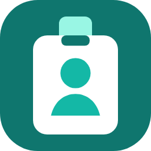
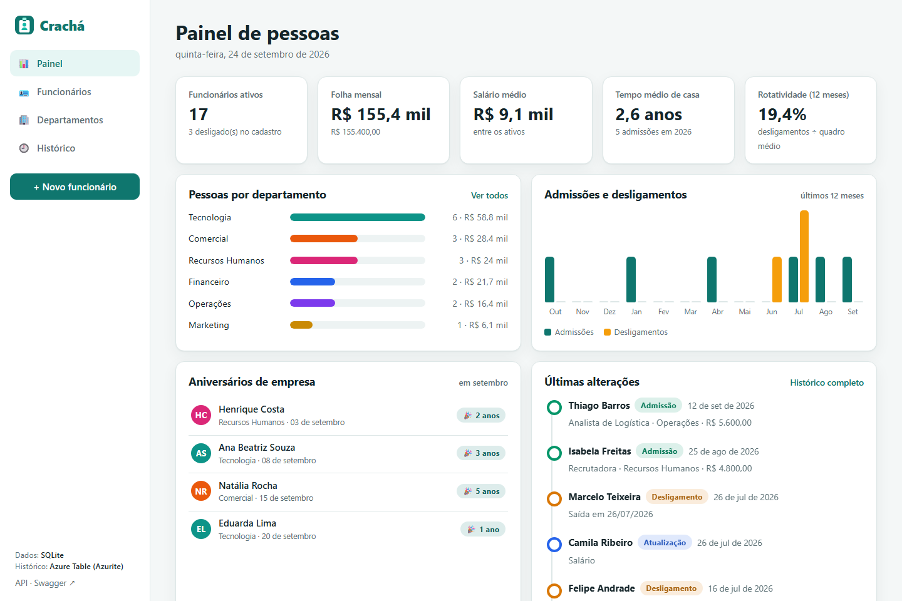
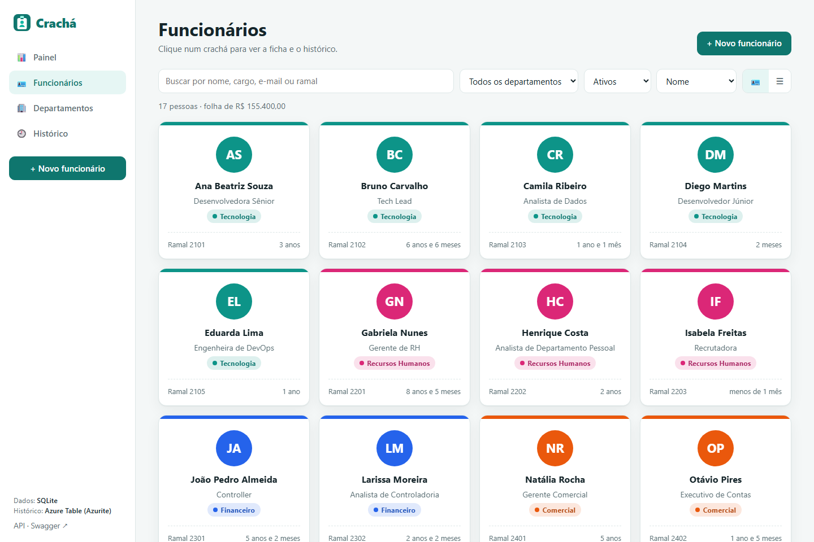
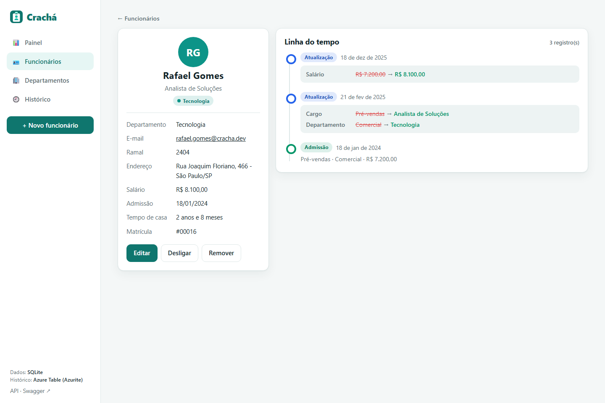
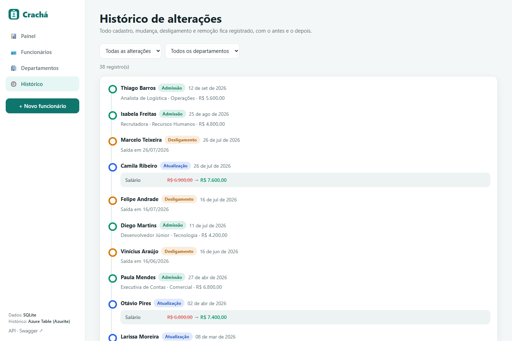
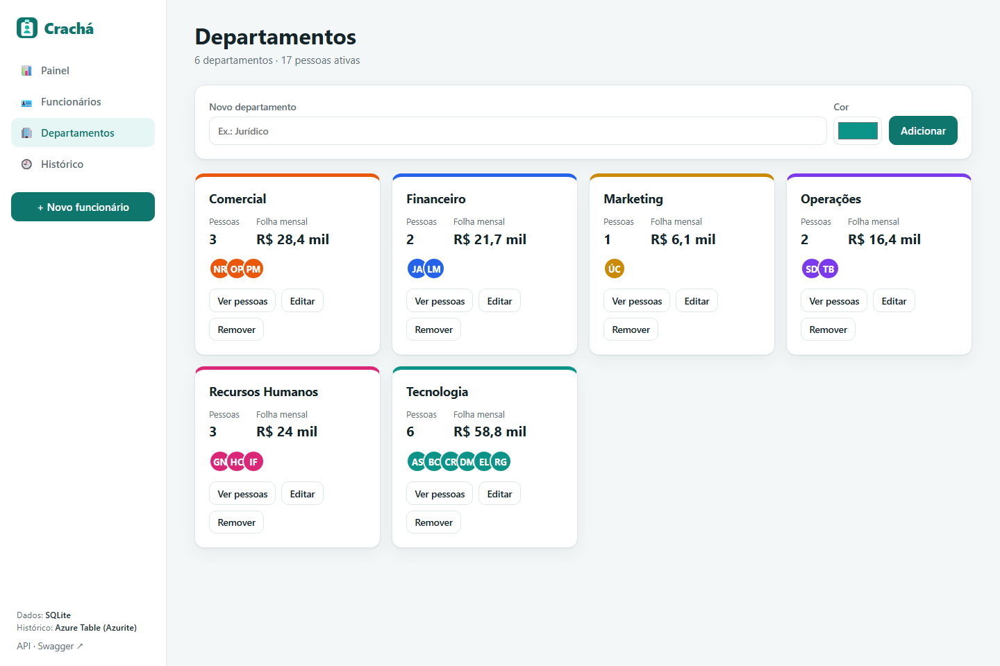

<p align="center">
  
</p>

<h1 align="center">Crachá</h1>

<p align="center">
  Sistema de RH com cadastro de funcionários, painel de pessoas e histórico de toda alteração, pronto para o Azure.<br>
  <b>.NET 9 · ASP.NET Core Web API · Entity Framework Core · Azure Table Storage · SQL Server / Azure SQL · SQLite · Bicep · HTML + CSS + JavaScript</b>
</p>

<p align="center">
  <a href="https://github.com/barbozadevti/cracha/actions/workflows/ci.yml"></a>
</p>

<p align="center">
  
</p>

---

## Sobre

O Crachá começou como o desafio *"Sistema de cadastro de funcionários na nuvem Azure"* (CRUD + log de alterações numa Azure Table) e virou um sistema de RH completo:

- **Painel**: funcionários ativos, folha mensal, salário médio, tempo médio de casa, **rotatividade** dos últimos 12 meses, admissões × desligamentos por mês, pessoas e folha por departamento e **aniversários de empresa** do mês.
- **Funcionários**: diretório em **crachás** ou em tabela, com busca por nome, cargo, e-mail ou ramal, filtros por departamento e situação e ordenação.
- **Ficha**: dados, tempo de casa e a **linha do tempo** da pessoa, com o **antes → depois** de cada campo alterado.
- **Desligar e reativar** sem apagar o cadastro. Remover também é possível, e o histórico continua disponível.
- **Departamentos** com cor, quantidade de pessoas e folha. Não é possível remover um departamento que ainda tem gente.
- **Histórico** geral filtrável por tipo (admissão, atualização, desligamento, reativação, remoção) e departamento.
- **API documentada** no Swagger, em `/swagger`.

O escopo foi definido com **Lean Inception** (visão, personas, jornadas, sequenciador e MVP): veja [docs/lean-inception.md](docs/lean-inception.md).

## Telas

| Funcionários | Ficha com linha do tempo |
|---|---|
|  |  |

| Histórico | Departamentos |
|---|---|
|  |  |

## Como o histórico funciona

Cada alteração gera um registro imutável com a **foto** do funcionário naquele momento (JSON) e a lista dos **campos que mudaram**, já formatada (`Salário: R$ 7.200,00 → R$ 8.100,00`). Salvar sem mudar nada não gera registro.

O histórico fica atrás da interface `IHistorico`, com duas implementações:

| Provedor | Onde grava | Quando usar |
|---|---|---|
| `AzureTable` | Azure Table `FuncionarioLog`: **PartitionKey = departamento**, **RowKey = ticks invertidos + id** (os mais novos vêm primeiro) | No Azure, ou localmente com o [Azurite](https://learn.microsoft.com/azure/storage/common/storage-use-azurite) |
| `Banco` | Tabela `Historico` no mesmo banco | Para rodar sem nenhum serviço do Azure |

```json
"Historico": {
  "Provedor": "AzureTable",
  "ConnectionString": "UseDevelopmentStorage=true",
  "Tabela": "FuncionarioLog"
}
```

## Como executar

### Com um clique (Windows)
Dê dois cliques em **`Abrir Cracha.cmd`** (ou no atalho *Crachá* da Área de Trabalho). O navegador abre em `http://localhost:5210`.

Se o Azurite estiver instalado (`npm install -g azurite`), o atalho o inicia sozinho e grava o histórico numa **Azure Table local**, como no Azure. A barra lateral mostra onde os dados estão sendo gravados.

### Pelo terminal
Pré-requisito: [.NET 9 SDK](https://dotnet.microsoft.com/download).

```bash
dotnet run --project src/Cracha.Api
```

Na primeira execução, as **migrations** são aplicadas e o banco SQLite é criado em `src/Cracha.Api/App_Data/cracha.db`, com 6 departamentos e 20 funcionários de exemplo (admissões, promoções, uma transferência e desligamentos, todos com histórico). Para começar vazio, use `"CriarExemplos": false`.

Para usar a Azure Table local:

```bash
azurite-table --location ~/.azurite
dotnet run --project src/Cracha.Api -- --Historico:Provedor=AzureTable
```

### Testes

```bash
dotnet test
```

São 25 testes de integração com `WebApplicationFactory`, cobrindo CRUD, validações (em **pt-BR**, para pegar erros de vírgula decimal), e-mail único, comparação antes/depois, desligar/reativar, remoção com histórico preservado, departamentos, painel e filtros do histórico. O relógio é injetado (`TimeProvider`), então datas, tempo de casa e aniversários são previsíveis.

Os mesmos testes rodam contra o **SQL Server** e a **Azure Table** com variáveis de ambiente. Bancos e tabelas temporários são apagados no fim:

```powershell
$env:CRACHA_SQLSERVER = "Server=localhost\sqlexpress;Trusted_Connection=True;TrustServerCertificate=True"
$env:CRACHA_TABLES = "UseDevelopmentStorage=true"
dotnet test
```

No GitHub Actions, o CI roda as duas combinações (SQLite + histórico no banco e SQL Server + Azurite em contêineres) e valida o Bicep.

## Publicando no Azure

A pasta [`infra/`](infra) tem a infraestrutura como código ([`main.bicep`](infra/main.bicep)) e um script de publicação:

```powershell
az login
./infra/deploy.ps1 -GrupoRecursos rg-cracha -Local brazilsouth
```

| Recurso | Uso |
|---|---|
| App Service (Linux, .NET 9, plano F1 gratuito) | API + frontend |
| Azure SQL Database (Basic) | cadastro (`Banco:Provedor = SqlServer`) |
| Storage Account + tabela `FuncionarioLog` | histórico (`Historico:Provedor = AzureTable`) |

As configurações vão para o App Service como variáveis (`Banco__ConnectionString`, `Historico__ConnectionString`...), sem nenhum segredo no repositório. As migrations são aplicadas quando a aplicação sobe. Para apagar tudo depois: `az group delete --name rg-cracha`.

## Arquitetura

```
src/Cracha.Api
├── Controllers/     Funcionarios, Departamentos, Painel (painel, histórico e /api/sistema)
├── Dados/           CrachaContext (um por provedor), IHistorico (Azure Table / banco), Auditoria, Exemplos
├── Migrations/      Sqlite/ e SqlServer/
├── Modelos/         Entidades e DTOs (FotoFuncionario.Comparar gera o antes → depois)
└── wwwroot/         Frontend em HTML, CSS e JavaScript puro (SPA com rotas por hash)
tests/Cracha.Tests   Testes de integração
infra/               Bicep + script de deploy
```

## API

| Verbo | Rota | Descrição |
|---|---|---|
| GET | `/api/funcionarios?busca=&departamentoId=&situacao=&ordem=&desc=` | Lista com filtros |
| GET | `/api/funcionarios/{id}` | Detalhe |
| POST | `/api/funcionarios` | Cadastra (registra **Inclusão**) |
| PUT | `/api/funcionarios/{id}` | Atualiza (registra **Atualização** com os campos alterados) |
| POST | `/api/funcionarios/{id}/desligar` | Desliga (registra **Desligamento**) |
| POST | `/api/funcionarios/{id}/reativar` | Reativa (registra **Reativação**) |
| DELETE | `/api/funcionarios/{id}` | Remove (registra **Remoção**) |
| GET | `/api/funcionarios/{id}/historico` | Linha do tempo da pessoa |
| GET/POST/PUT/DELETE | `/api/departamentos` | Departamentos |
| GET | `/api/painel` | Indicadores |
| GET | `/api/historico?tipo=&departamento=&limite=` | Histórico geral |

## Desafio original

A entrega do desafio da DIO, com os `TODO` resolvidos no código original, está em [barbozadevti/trilha-net-azure-desafio](https://github.com/barbozadevti/trilha-net-azure-desafio).
