<p align="center">
  
</p>

<h1 align="center">Crachá</h1>

<p align="center">
  Sistema de RH com controle de acesso por perfil, organograma, férias com aprovação, crachá com QR Code e histórico auditável de toda alteração, pronto para o Azure.<br>
  <b>.NET 9 · ASP.NET Core · Entity Framework Core · Azure Table Storage · Azure Blob Storage · Azure SQL / SQL Server · SQLite · Bicep · Docker · GitHub Actions · HTML + CSS + JavaScript</b>
</p>

<p align="center">
  <a href="https://github.com/barbozadevti/cracha/actions/workflows/ci.yml"></a>
</p>

<p align="center">
  
</p>

---

## Sobre

O Crachá começou como o desafio *"Sistema de cadastro de funcionários na nuvem Azure"* (CRUD + log de alterações numa Azure Table) e virou um sistema de RH pensado como produto de empresa:

| Área | O que faz |
|---|---|
| **Acesso** | Login por cookie seguro, quatro perfis (Administrador, RH, Gestor, Colaborador), gestão de acessos e troca de senha. Mudar perfil, senha ou situação **derruba as sessões abertas** da pessoa. |
| **LGPD** | Salário, endereço e histórico só aparecem para o RH, para o **gestor da pessoa** (equipe direta e indireta) e para a **própria pessoa**. Quem não vê salários também não consegue ordenar por eles. |
| **Auditoria** | Toda alteração fica registrada com **quem fez**, quando e o **antes → depois** de cada campo, numa Azure Table. O histórico sobrevive até à remoção do funcionário. |
| **Organograma** | Gestor imediato de cada pessoa, árvore navegável e bloqueio de ciclos (ninguém vira gestor do próprio chefe). Quem lidera uma equipe ativa não pode ser desligado antes de transferi-la. |
| **Férias e ausências** | O colaborador pede, o gestor ou o RH aprova ou recusa (com motivo). Regras de 5 a 30 dias, bloqueio de períodos sobrepostos, calendário da equipe e "ausentes hoje". |
| **Crachá** | Foto do funcionário no **Azure Blob Storage**, validada pelos bytes do arquivo, e **crachá para impressão** (CR80) com QR Code que abre a ficha. |
| **Painel** | Quadro, folha, salário médio, tempo de casa, rotatividade, admissões × desligamentos, aniversários de empresa e pedidos aguardando decisão. O gestor vê o painel **da própria equipe**. |
| **Relatórios** | Exportação CSV pronta para o Excel em português (`;`, UTF-8 com BOM), protegida contra injeção de fórmulas. |
| **Operação** | Health checks (`/health`), cabeçalhos de segurança (CSP, X-Frame-Options), limite de tentativas de login, Docker Compose e deploy no Azure via Bicep + GitHub Actions. |
| **Experiência** | Tema claro/escuro, busca rápida com **Ctrl+K**, portal do colaborador, layout para celular. |

O escopo foi definido com **Lean Inception** (visão, personas, jornadas, sequenciador e MVP): veja [docs/lean-inception.md](docs/lean-inception.md).

## Experimente

Suba o sistema (veja [Como executar](#como-executar)) e entre com uma das **contas de demonstração**, todas com a senha `Cracha@2026`:

| Conta | Perfil | O que mostra |
|---|---|---|
| `admin@cracha.dev` | Administrador | Tudo, inclusive a tela de **Acessos** |
| `gabriela.nunes@cracha.dev` | RH | Cadastro completo, salários, lançamento de atestados |
| `helena.prado@cracha.dev` | Gestor | Diretora: a empresa inteira é a equipe dela |
| `bruno.carvalho@cracha.dev` | Gestor | Painel e aprovações só da equipe de Tecnologia |
| `ana.souza@cracha.dev` | Colaborador | Portal pessoal, diretório sem salários, pedido de férias |

As contas aparecem como botões na tela de login. Em produção, `Acesso:Demonstracao = false` as esconde.

## Telas

| Organograma | Ficha com linha do tempo |
|---|---|
| 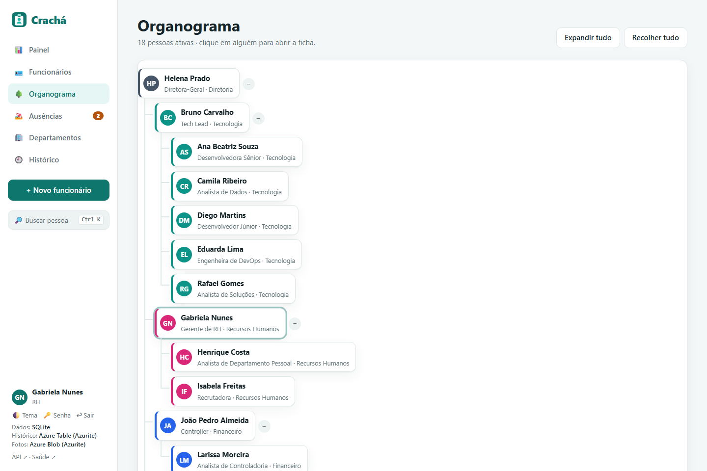 |  |

| Aprovação de férias (gestor) | Calendário de ausências |
|---|---|
| 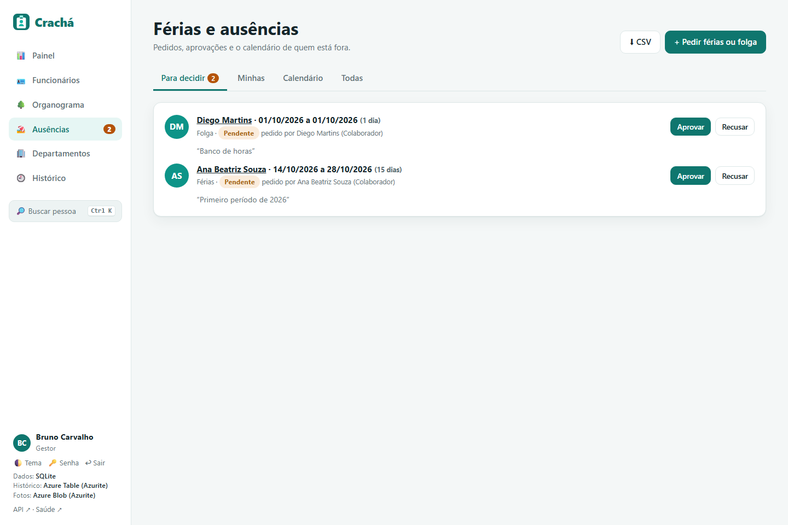 | 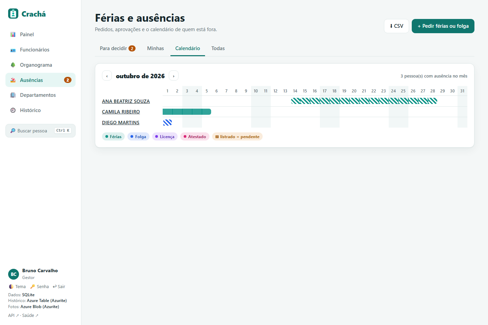 |

| LGPD: colaborador vendo a ficha de outra pessoa | Crachá para impressão com QR Code |
|---|---|
| 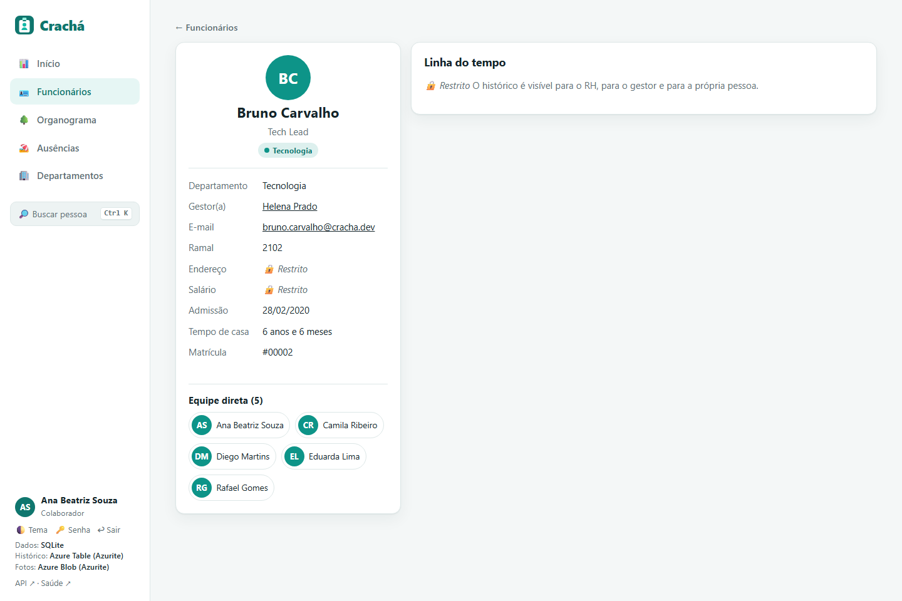 | 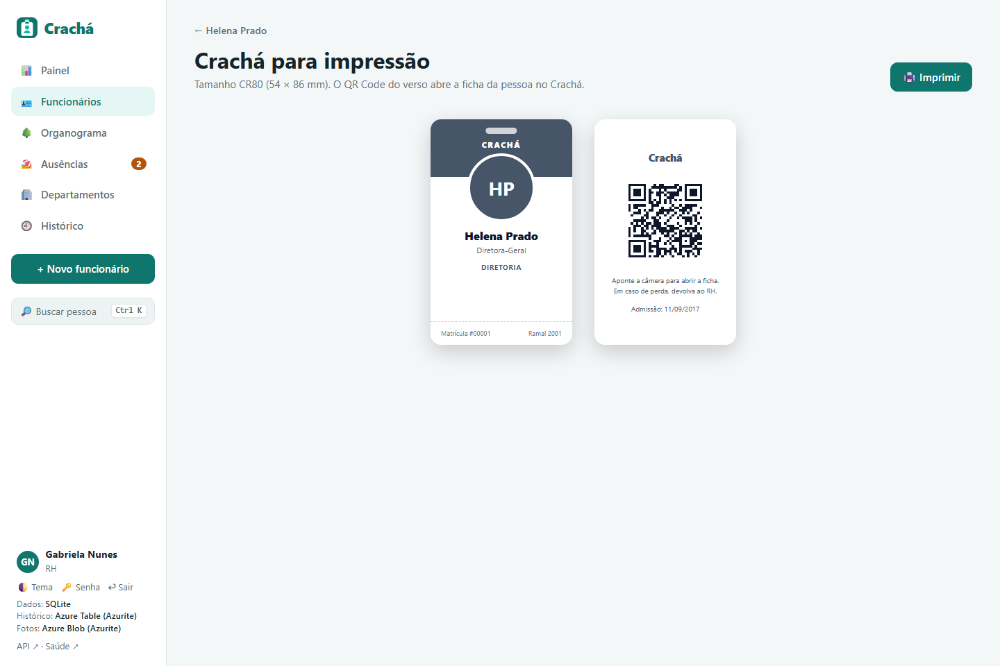 |

| Funcionários | Histórico com autor |
|---|---|
|  |  |

| Login | Acessos (administrador) |
|---|---|
| 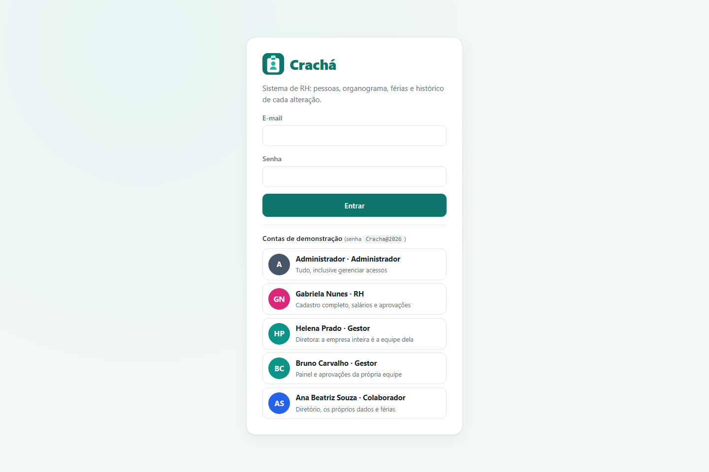 | 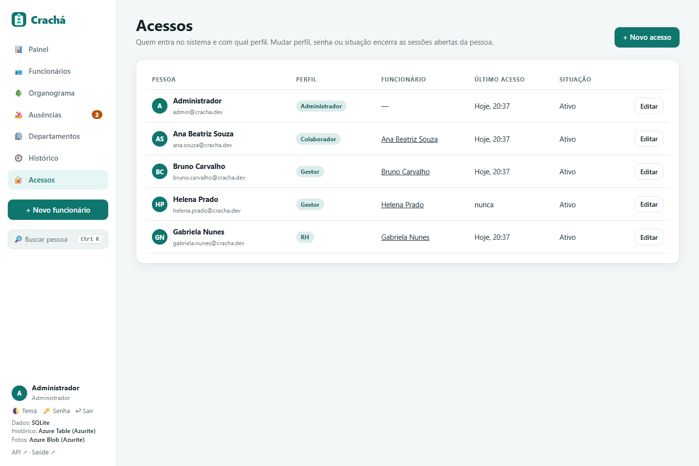 |

| Tema escuro | Celular |
|---|---|
| 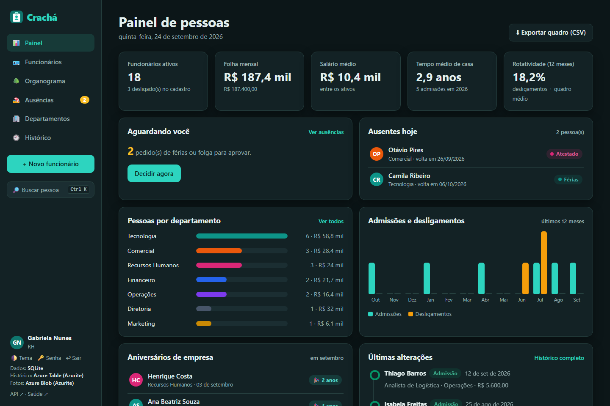 | 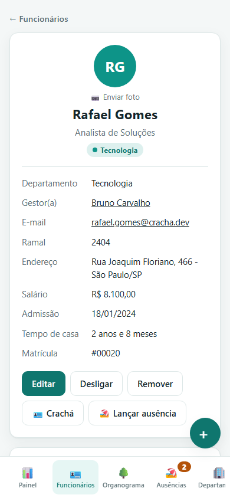 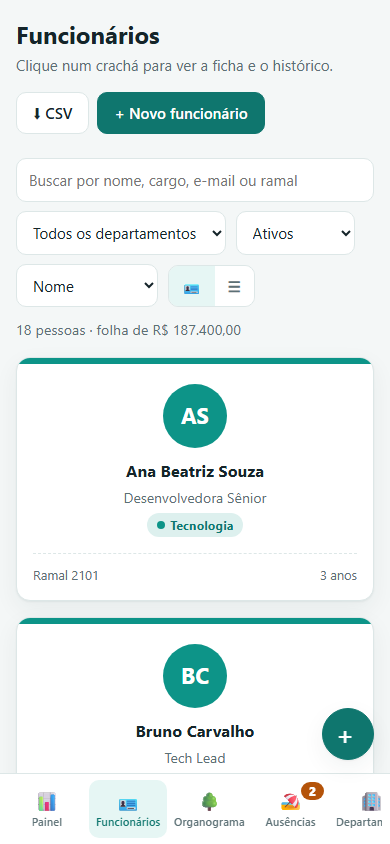 |

## Arquitetura

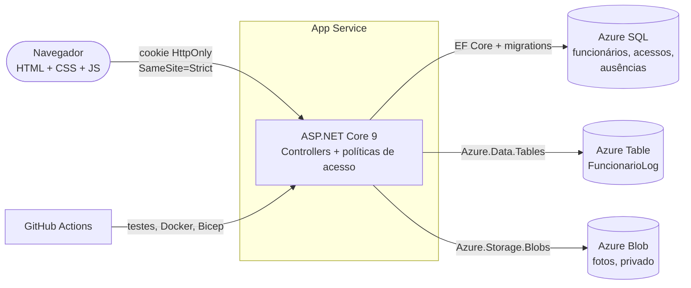

| Peça | Local (sem nada instalado) | Local com Azurite / Docker | Azure |
|---|---|---|---|
| Cadastro | SQLite em `App_Data` | SQL Server (contêiner) | Azure SQL Database |
| Histórico | Tabela no mesmo banco | Azure Table no Azurite | Azure Table |
| Fotos | Pasta `App_Data/fotos` | Blob no Azurite | Blob Storage |

Cada peça fica atrás de uma interface (`IHistorico`, `IArmazenamentoFotos`) e muda só por configuração.

```
src/Cracha.Api
├── Controllers/   Funcionarios, Departamentos, Ausencias, Conta, Usuarios, Cracha (foto e QR),
│                  Exportacao (CSV), Painel (painel, histórico, organograma, sistema)
├── Dados/         CrachaContext (um por provedor), Historico (Table/banco), Fotos (Blob/disco), Exemplos
├── Seguranca/     Autenticação por cookie, perfis e políticas, Visibilidade (LGPD), health checks, cabeçalhos
├── Migrations/    Sqlite/ e SqlServer/
├── Modelos/       Entidades e DTOs (FotoFuncionario.Comparar gera o antes → depois)
└── wwwroot/       Frontend em JavaScript puro (SPA com rotas por hash)
tests/Cracha.Tests 68 testes de integração
infra/             Bicep + script de deploy
```

## Permissões

| Ação | Administrador | RH | Gestor | Colaborador |
|---|:---:|:---:|:---:|:---:|
| Diretório, organograma, departamentos | ✅ | ✅ | ✅ | ✅ |
| Ver salário, endereço e histórico | todos | todos | equipe + si | só si |
| Cadastrar, editar, desligar, remover | ✅ | ✅ | — | — |
| Painel e histórico geral | empresa | empresa | equipe | — |
| Pedir férias e folgas | ✅ | ✅ | ✅ | ✅ |
| Aprovar pedidos | todos | todos | da equipe (nunca o próprio) | — |
| Lançar licença e atestado | ✅ | ✅ | — | — |
| Trocar a própria foto | ✅ | ✅ (de todos) | ✅ | ✅ |
| Gerenciar acessos | ✅ | — | — | — |

As regras são aplicadas na **API** (políticas de autorização + serviço `Visibilidade`); a interface só esconde o que não se aplica.

## Segurança

- **Senhas** com o `PasswordHasher` do ASP.NET Core Identity (PBKDF2), com regravação automática quando o algoritmo evolui; exigência de 8+ caracteres com letras e números.
- **Sessão** em cookie `HttpOnly` e `SameSite=Strict` (barra CSRF), expiração deslizante de 8 h e **carimbo de segurança**: trocar perfil, senha ou situação invalida as sessões já abertas.
- **Login** com a mesma mensagem para e-mail inexistente e senha errada, e **limite de 10 tentativas por minuto** por IP (429).
- **Cabeçalhos**: Content-Security-Policy sem scripts inline, `X-Frame-Options: DENY`, `nosniff`, `Referrer-Policy`, `Permissions-Policy`.
- **Upload** de foto validado pelos primeiros bytes (JPEG, PNG, WebP), até 2 MB, em container privado.
- **CSV** com neutralização de fórmulas (`=`, `+`, `-`, `@`).
- **Nenhum segredo no repositório**: no Azure, as connection strings vão para o App Service pelo Bicep; no GitHub, o deploy usa **OIDC**.

## Como executar

### Com um clique (Windows)
Dê dois cliques em **`Abrir Cracha.cmd`** (ou no atalho *Crachá* da Área de Trabalho). O navegador abre em `http://localhost:5210`.

Se o [Azurite](https://learn.microsoft.com/azure/storage/common/storage-use-azurite) estiver instalado (`npm install -g azurite`), o atalho o inicia sozinho e grava o histórico numa **Azure Table** e as fotos num **Blob Storage** locais, como no Azure. A barra lateral mostra onde cada coisa está sendo gravada.

### Pelo terminal
Pré-requisito: [.NET 9 SDK](https://dotnet.microsoft.com/download).

```bash
dotnet run --project src/Cracha.Api
```

Na primeira execução as **migrations** são aplicadas e o banco SQLite é criado com 7 departamentos, 21 funcionários em hierarquia, histórico (admissões, promoções, uma transferência, desligamentos), ausências e as contas de demonstração. Para começar vazio, use `"CriarExemplos": false`: só o administrador é criado, com senha aleatória mostrada no log.

### Com Docker (como em produção)

```bash
docker compose up --build
```

Sobe a API, um **SQL Server** e o **Azurite** (Table + Blob). Abra `http://localhost:5210`.

### Testes

```bash
dotnet test
```

São **68 testes de integração** com `WebApplicationFactory`, cobrindo:

- CRUD e validações (rodando em **pt-BR**, para pegar erros de vírgula decimal);
- login, limite de tentativas, sessões derrubadas e regras de cada perfil;
- LGPD: salário e endereço mascarados, sem ordenação por salário;
- organograma: ciclos bloqueados e desligamento de quem lidera equipe;
- fluxo de férias: sobreposição, limites, aprovação só pelo gestor certo;
- fotos: validação pelos bytes e permissão;
- QR Code, CSV (inclusive injeção de fórmula), health check e cabeçalhos de segurança.

O relógio é injetado (`TimeProvider`), então datas, tempo de casa e aniversários são previsíveis. Os mesmos testes rodam contra **SQL Server** e **Azurite** com variáveis de ambiente (bancos, tabelas e containers temporários são apagados no fim):

```powershell
$env:CRACHA_SQLSERVER = "Server=localhost\sqlexpress;Trusted_Connection=True;TrustServerCertificate=True"
$env:CRACHA_TABLES = "UseDevelopmentStorage=true"
dotnet test
```

### CI

A cada push, o [GitHub Actions](.github/workflows/ci.yml) roda:
1. os testes com SQLite;
2. os testes com SQL Server + Azure Table e Blob (Azurite em contêineres);
3. `docker compose up` com um teste de fumaça (health, login e painel);
4. a validação do Bicep.

## Publicando no Azure

A pasta [`infra/`](infra) tem a infraestrutura como código ([`main.bicep`](infra/main.bicep)):

| Recurso | Uso |
|---|---|
| App Service (Linux, .NET 9, plano F1 gratuito) | API + frontend, com health check em `/health` |
| Azure SQL Database (Basic) | cadastro, acessos e ausências |
| Storage Account: tabela `FuncionarioLog` | histórico de alterações |
| Storage Account: container privado `fotos` | fotos dos funcionários |

Dois caminhos:

- **Pelo terminal**: `az login` e depois `./infra/deploy.ps1 -GrupoRecursos rg-cracha -Local brazilsouth`.
- **Pelo GitHub**: o workflow [Deploy no Azure](.github/workflows/deploy-azure.yml) (manual) roda os testes, aplica o Bicep, publica e confere o `/health`. Ele autentica por **OIDC** (credencial federada), sem senha da nuvem guardada no GitHub.

Para apagar tudo depois: `az group delete --name rg-cracha`.

## API

Documentada no Swagger em `/swagger` (entre pela tela do sistema e use o Swagger na mesma aba). Principais rotas:

| Verbo | Rota | Descrição |
|---|---|---|
| POST | `/api/conta/entrar` · `/sair` · `/senha` | Sessão |
| GET | `/api/funcionarios?busca=&departamentoId=&gestorId=&situacao=&ordem=` | Diretório (com máscara LGPD) |
| POST/PUT/DELETE | `/api/funcionarios[/{id}]` | Cadastro (registra no histórico com autor) |
| POST | `/api/funcionarios/{id}/desligar` · `/reativar` | Situação |
| GET | `/api/funcionarios/{id}/historico` | Linha do tempo |
| GET/PUT/DELETE | `/api/funcionarios/{id}/foto` | Foto (Blob) |
| GET | `/api/funcionarios/{id}/qrcode` | QR Code do crachá |
| GET/POST | `/api/ausencias` | Férias e ausências |
| POST | `/api/ausencias/{id}/decisao` · `/cancelar` | Aprovação |
| GET | `/api/organograma` · `/api/painel` · `/api/historico` | Visões |
| GET | `/api/exportar/funcionarios.csv` · `historico.csv` · `ausencias.csv` | Relatórios |
| GET/POST/PUT | `/api/usuarios` | Acessos (administrador) |
| GET | `/health` · `/health/vivo` | Saúde |

## Desafio original

A entrega do desafio da DIO, com os `TODO` resolvidos no código original, está em [barbozadevti/trilha-net-azure-desafio](https://github.com/barbozadevti/trilha-net-azure-desafio).
